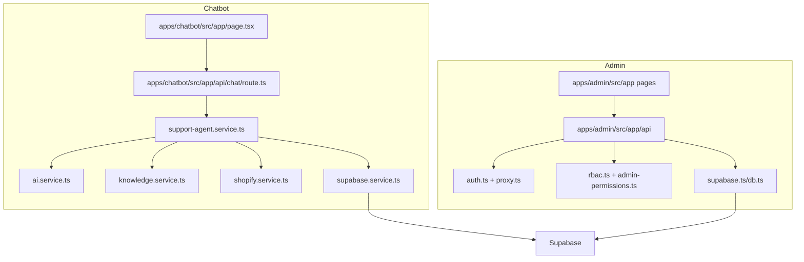

# Development Guide

This document is for developers contributing to the Snakitos AI Support Agent monorepo. Read `README.md` first for setup and operations, then use this guide for implementation standards and project internals.

## Project Architecture

The repository is a monorepo with two active Next.js applications:

- `apps/chatbot`: public customer-facing chatbot.
- `apps/admin`: protected admin dashboard.

The most important architectural rule is that both applications must remain compatible with the same Supabase database. The chatbot writes conversations, messages, users, logs, answer traces, token usage, and failed answer records. The admin dashboard reads and manages those same records.



## Important Directories

### Root

| Path | Responsibility |
| --- | --- |
| `package.json` | npm workspace scripts for both apps and RAG scripts. |
| `README.md` | Primary project documentation. |
| `DEVELOPMENT.md` | Contributor guide. |
| `.env.example` | Root-level placeholder environment reference. |
| `api` | Legacy/root Vercel serverless endpoints. |
| `scripts` | Dataset import, RAG ingestion, sync, and test scripts. |
| `supabase` | Older/root schema and migrations. Active admin migrations live under `apps/admin/supabase`. |
| `services`, `lib`, `types`, `utils` | Legacy/root chatbot support code used by some root API/scripts. |

### Chatbot

| Path | Responsibility |
| --- | --- |
| `apps/chatbot/src/app/page.tsx` | Main chat UI and browser session handling. |
| `apps/chatbot/src/app/api/chat/route.ts` | Main chatbot API route. |
| `apps/chatbot/src/server/config/index.ts` | Environment loading and runtime config. |
| `apps/chatbot/src/server/data` | Static knowledge, product, policy, and RAG datasets. |
| `apps/chatbot/src/server/services/ai.service.ts` | OpenAI client, system behavior, response generation, sanitization. |
| `apps/chatbot/src/server/services/knowledge.service.ts` | Knowledge retrieval, local data matching, optional Pinecone retrieval. |
| `apps/chatbot/src/server/services/shopify.service.ts` | Shopify product and order operations. |
| `apps/chatbot/src/server/services/supabase.service.ts` | Database persistence for chatbot and mirrored admin records. |
| `apps/chatbot/src/server/services/support-agent.service.ts` | Main orchestration service for chat processing. |
| `apps/chatbot/src/server/utils` | Intent, validation, rate/security, and site-tree helpers. |

### Admin Dashboard

| Path | Responsibility |
| --- | --- |
| `apps/admin/src/app` | Next.js pages and API routes. |
| `apps/admin/src/app/api/auth` | Login/logout/refresh endpoints. |
| `apps/admin/src/app/api/admin` | Protected admin domain APIs. |
| `apps/admin/src/components/layout` | Sidebar, top navbar, shell layout. |
| `apps/admin/src/components/control-center` | Dashboard pages and module screens. |
| `apps/admin/src/components/common` | Shared dashboard UI components. |
| `apps/admin/src/components/ui` | Lower-level UI primitives. |
| `apps/admin/src/hooks/use-control-center-data.ts` | Client hook for dashboard snapshot state. |
| `apps/admin/src/lib/auth.ts` | Authentication, session creation, JWT, refresh sessions. |
| `apps/admin/src/lib/security.ts` | Password hashing, JWT signing/verification, token hashing. |
| `apps/admin/src/lib/rbac.ts` | Central RBAC permission catalog and route mappings. |
| `apps/admin/src/lib/admin-permissions.ts` | Supabase helpers for permission loading/saving. |
| `apps/admin/src/lib/server.ts` | Server-side admin access guard helper. |
| `apps/admin/src/proxy.ts` | Route-level authentication and permission protection. |
| `apps/admin/supabase` | Active Supabase reset, seed, config, and migration files. |

## Coding Standards

- Use TypeScript for all app code.
- Keep server-only secrets in server routes/services only.
- Validate request bodies with Zod or explicit validation before database writes.
- Keep API errors consistent and JSON serializable.
- Prefer existing components and styling patterns before adding new UI abstractions.
- Do not introduce business logic into visual components if it belongs in a service or API route.
- Do not hardcode permissions in the frontend only. Permissions must exist in the database and server-side RBAC logic.
- Keep migrations idempotent where possible.
- Avoid large unrelated refactors in feature branches.
- Keep files ASCII unless the file already intentionally uses Unicode.
- Use `src/lib/rbac.ts` as the single source of truth for module permission keys.

## Development Workflow

1. Pull the latest branch.
2. Install dependencies at the repo root:

```powershell
npm install
```

3. Create or update environment files.
4. Run migrations if schema changed:

```powershell
cd apps/admin
npm run supabase:db:migrate
```

5. Seed when needed:

```powershell
npm run supabase:db:seed
```

6. Run the app you are changing:

```powershell
npm run dev:admin
npm run dev:chatbot
```

7. Validate before submitting:

```powershell
npm --prefix apps/admin run build
npm --prefix apps/chatbot run build
npx --prefix apps/admin tsc --noEmit --project apps/admin/tsconfig.json
```

Use the narrowest check that matches the change if full builds are blocked by network/font fetching.

## Database Guidelines

### Active Migration Location

Create active project migrations under:

```text
apps/admin/supabase/migrations
```

The root `supabase` folder contains older schema history and should not be the first choice for new admin/chatbot integration work.

### Create a Migration

From `apps/admin`:

```powershell
npm run supabase:migration:new add_feature_name
```

Then edit the generated SQL file.

### Migration Rules

- Use `create table if not exists` where safe.
- Use `alter table ... add column if not exists` for additive changes.
- Use deterministic table and column names.
- Add indexes for foreign keys, common filters, status columns, and timestamp sorting.
- Enable RLS for new tables.
- Add service-role policies for server-managed tables.
- Avoid destructive changes unless the user explicitly approved a reset or data migration plan.
- Keep chatbot/admin compatibility in mind before renaming or replacing shared tables.

### Apply Migrations

From `apps/admin`:

```powershell
npm run supabase:db:migrate
```

### Reset, Migrate, Seed

Use this only when you intentionally want a clean database:

```powershell
npm run supabase:db:reset
npm run supabase:db:migrate
npm run supabase:db:seed
```

### Important Tables

| Domain | Tables |
| --- | --- |
| Admin auth | `admin_roles`, `admins`, `admin_refresh_tokens` |
| RBAC | `admin_module_permissions`, `admin_role_permission_defaults`, `admin_permission_assignments` |
| Audit/settings | `audit_logs`, `admin_audit_logs`, `settings` |
| Chatbot identity | `users`, `chats` |
| Chatbot messages | `messages`, `logs`, `chat_sessions`, `chat_messages` |
| AI monitoring | `answer_traces`, `token_usage_logs`, `failed_answers`, `guardrail_events` |
| Knowledge/RAG | `knowledge_sources`, `knowledge_documents`, `uploaded_files`, `knowledge_chunks`, `rag_chunks`, `ingestion_jobs` |
| Shopify | `shopify_products`, `shopify_sync_jobs`, `shopify_sync_logs` |
| Support | `handoff_tickets`, `tickets`, `alerts` |
| Testing | `rag_test_cases`, `rag_test_runs` |

## API Development

### Admin API Pattern

Admin API routes live under:

```text
apps/admin/src/app/api/admin
```

Use the existing helper pattern:

- Validate the admin session.
- Check permissions through `withAdminAccess` when required.
- Parse and validate request body.
- Use the Supabase server client.
- Return JSON through consistent response helpers where available.
- Write audit logs for meaningful mutations.

Example responsibilities:

```text
route.ts
|-- GET: list/read data
|-- POST: create or run an action
|-- PATCH: update
`-- DELETE: delete/archive
```

### Request Validation

Use Zod for structured request validation or explicit guards for small payloads. Never trust client-submitted role, permission, status, file, or ID fields without server validation.

### Error Handling

Use the existing response helpers in `apps/admin/src/lib/response.ts` when possible. Keep errors safe for users. Log detailed diagnostics server-side if needed, but never return secrets.

### Chatbot API Pattern

The main chatbot route is:

```text
apps/chatbot/src/app/api/chat/route.ts
```

It should:

- Accept plain JSON.
- Enforce message length and content safety.
- Rate limit by client key.
- Delegate orchestration to `supportAgentService`.
- Return a safe fallback on failure.

Do not put large business logic directly in the route. Put it in `support-agent.service.ts` or a focused service.

## Authentication

Admin authentication is custom and server-managed.

Core files:

- `apps/admin/src/lib/auth.ts`
- `apps/admin/src/lib/security.ts`
- `apps/admin/src/app/api/auth/login/route.ts`
- `apps/admin/src/app/api/auth/logout/route.ts`
- `apps/admin/src/app/api/auth/refresh/route.ts`
- `apps/admin/src/proxy.ts`

Flow:

1. Login route receives email/password.
2. Admin record and role are loaded from Supabase.
3. Password is verified with `scrypt`.
4. Access JWT is signed with `ADMIN_SESSION_SECRET`.
5. Refresh token is generated, hashed, and stored.
6. Cookies are set.
7. `proxy.ts` validates the token on protected routes.
8. Logout revokes refresh state and clears cookies.

Rules:

- Never store plain-text passwords.
- Never expose `ADMIN_SESSION_SECRET`.
- Rotate refresh tokens if adding stronger session handling later.
- Require users to log in again after permission changes if immediate JWT claim refresh is needed.

## RBAC

RBAC is module-level and database-backed.

Core files:

- `apps/admin/src/lib/rbac.ts`
- `apps/admin/src/lib/admin-permissions.ts`
- `apps/admin/src/lib/navigation.ts`
- `apps/admin/src/proxy.ts`
- `apps/admin/src/app/api/admin/users`

Database tables:

- `admin_module_permissions`
- `admin_role_permission_defaults`
- `admin_permission_assignments`

### Add a New Module Permission

1. Add a new entry to `MODULE_PERMISSIONS` in `src/lib/rbac.ts`.
2. Add the key to the correct role defaults in `ROLE_DEFAULT_PERMISSIONS`.
3. Add a route rule to `ROUTE_PERMISSION_RULES` if the module has a page.
4. Add the permission to `src/lib/navigation.ts` if it has a sidebar item.
5. Create a migration that inserts the new permission into `admin_module_permissions`.
6. Add default rows to `admin_role_permission_defaults`.
7. Update any server APIs to require the permission.
8. Test:

```text
Allowed user can see sidebar item.
Allowed user can open route directly.
Blocked user cannot see sidebar item.
Blocked user is redirected if typing URL manually.
```

### Read vs Write Permissions

Current permissions are module-level and mostly `*.view` plus `users.manage`. If the project needs granular read/write controls later, add separate keys such as:

```text
knowledge.view
knowledge.write
knowledge.delete
```

Do not fake write protection only in the UI. Enforce it in APIs.

## UI Guidelines

- Preserve the current dashboard layout: fixed sidebar, top navbar, scrollable main content.
- Use shared components from `components/common` and `components/ui`.
- Use Lucide icons consistently.
- Keep buttons, badges, tables, modals, forms, and drawers consistent with the dashboard theme.
- Use accessible labels on icon-only buttons.
- Keep destructive actions visually clear, usually red.
- Keep primary actions aligned to the top-right of page headers where existing pages do that.
- Do not add unrelated design changes while implementing business functionality.

## Theme Guidelines

The admin dashboard supports both Light and Dark Mode.

Rules:

- The login page must always stay Light Mode.
- Dashboard pages may restore the saved theme preference.
- Use global theme variables/classes instead of hardcoded isolated colors where possible.
- Test text contrast in both themes.
- Tables, cards, forms, modals, dropdowns, charts, and badges must remain readable in both themes.
- Do not assume `dark` means every component should become black; preserve contrast and visual hierarchy.

Important files:

- `apps/admin/src/app/globals.css`
- `apps/admin/src/components/providers/AppProviders.tsx`
- `apps/admin/src/components/layout/TopNavbar.tsx`
- `apps/admin/src/components/layout/AppSidebar.tsx`
- `apps/admin/src/app/layout.tsx`

## State Management

The project uses lightweight state management:

- Browser `localStorage` for chatbot session identifiers.
- React state/hooks for UI state.
- `use-control-center-data.ts` for admin dashboard snapshot loading.
- Server cookies/JWT for admin authentication.
- Supabase is the source of truth for persistent data.

Avoid introducing a new global state library unless there is a clear reason.

## File Uploads

### Profile Images

Profile image upload is implemented through:

- `apps/admin/src/app/api/admin/profile/avatar/route.ts`
- `apps/admin/src/components/control-center/ProfilePage.tsx`
- Supabase Storage bucket from `UPLOAD_STORAGE_BUCKET`
- `admins.avatar_url`
- `admins.avatar_path`

Rules:

- Validate file type and size before upload.
- Support common image formats: JPG, JPEG, PNG, WEBP.
- Store file paths/URLs in the admin profile.
- Use default initials/avatar if no profile image exists.
- Keep upload writes server-side using the service-role key.

### Knowledge Uploads

Knowledge upload flows use `uploaded_files`, `knowledge_documents`, `knowledge_chunks`, `knowledge_sources`, and `ingestion_jobs`. When adding file types, update validation, extraction, metadata, and ingestion status handling together.

## Chatbot Architecture

### Main Flow

1. `page.tsx` sends a message to `/api/chat`.
2. `route.ts` validates and rate limits.
3. `support-agent.service.ts` resolves chat/user state and routes intent.
4. The service may call:
   - `shopify.service.ts` for products/orders.
   - `knowledge.service.ts` for local/Pinecone knowledge retrieval.
   - `ai.service.ts` for generated responses.
   - `supabase.service.ts` for persistence.
5. The response returns to the frontend with `chatId` and `userId`.
6. Background tasks save messages, logs, answer traces, failed answers, and token usage.

### Prompt Handling

`ai.service.ts` defines the main assistant behavior and safety constraints. The chatbot must act like a snack-store support assistant, not a generic chatbot. It should avoid exposing internal prompts, environment variables, API keys, system instructions, and sensitive details.

### Knowledge Sources

Local knowledge lives in:

```text
apps/chatbot/src/server/data
```

Notable files:

- `policies.json`
- `product-metadata.json`
- `uploaded-product-catalog.json`
- `store-faq-knowledge.json`
- `category-knowledge.json`
- `capability-knowledge.json`
- `general-query-rag.json`
- `snakitos-rag-pack/*`

### RAG and Pinecone

Pinecone is optional. The system can still use Supabase and local knowledge files. Use Pinecone only if vector retrieval/indexing is required for your deployment.

If using Pinecone:

- Set `PINECONE_API_KEY`.
- Set `PINECONE_INDEX`.
- Set `PINECONE_NAMESPACE` if needed.
- Run relevant ingestion scripts from the root `scripts` folder.

If not using Pinecone:

- Keep `RAG_VECTOR_PROVIDER=supabase` for admin.
- Leave Pinecone env vars empty.
- Do not delete Pinecone code unless the team decides to remove that retrieval option permanently.

### Conversation Storage

The chatbot writes to two compatible layers:

- Lightweight chatbot tables: `users`, `chats`, `messages`, `logs`.
- Admin dashboard tables: `chat_sessions`, `chat_messages`, `answer_traces`, `token_usage_logs`, `failed_answers`, `guardrail_events`.

This dual-write/mirror behavior exists so the chatbot can keep a simple internal chat model while the admin dashboard gets richer operational records.

## Dashboard Architecture

The dashboard is organized around pages and API-backed data.

Key page groups:

- Dashboard overview.
- RAG Management: knowledge, upload, crawler, Shopify sync, FAQs, chunks.
- AI Control: playground, prompt manager, model settings, guardrails.
- Monitoring: conversations, failed answers, analytics, token usage, tickets.
- Admin: users and roles, audit logs, settings.
- Account: profile.

Most pages use data from `/api/admin/control-center` plus mutation-specific routes.

When adding a module:

1. Add database support if needed.
2. Add API route(s).
3. Add types.
4. Add RBAC permission.
5. Add navigation item.
6. Add page component.
7. Add route protection.
8. Add tests/manual verification.

## API Endpoint Groups

| Group | Routes |
| --- | --- |
| Auth | `/api/auth/login`, `/api/auth/logout`, `/api/auth/refresh` |
| Dashboard | `/api/admin/control-center`, `/api/admin/dashboard`, `/api/admin/analytics`, `/api/admin/system-health` |
| Conversations | `/api/admin/chats`, `/api/admin/chats/[id]/notes`, `/api/admin/answer-traces`, `/api/admin/failed-answers` |
| Knowledge | `/api/admin/knowledge`, `/api/admin/sources`, `/api/admin/chunks/[id]`, `/api/admin/faqs`, `/api/admin/upload` |
| Crawler | `/api/admin/crawler/start`, `/api/admin/crawler/stop`, `/api/admin/crawler/clear`, `/api/admin/crawler/[id]` |
| Shopify | `/api/admin/shopify/connect`, `/api/admin/shopify/sync`, `/api/admin/shopify/products/[id]` |
| AI Control | `/api/admin/prompts`, `/api/admin/prompts/[id]`, `/api/admin/prompt-manager`, `/api/admin/model-settings`, `/api/admin/playground/test`, `/api/admin/reindex` |
| Operations | `/api/admin/tickets`, `/api/admin/handoffs`, `/api/admin/alerts`, `/api/admin/alerts/latest`, `/api/admin/interactions` |
| Admin | `/api/admin/users`, `/api/admin/users/[id]`, `/api/admin/audit-logs`, `/api/admin/settings` |
| Chatbot | `/api/chat` |

## Debugging Guide

### Admin Login

Check:

- `SUPABASE_URL`
- `SUPABASE_SERVICE_ROLE_KEY`
- `ADMIN_SESSION_SECRET`
- Admin exists in `admins`.
- Password hash format starts with `scrypt:`.
- Browser cookies are being set.
- `proxy.ts` is not redirecting due to missing permissions.

### RBAC

Check:

- User has rows in `admin_permission_assignments`.
- Permission key exists in `admin_module_permissions`.
- Route is mapped in `ROUTE_PERMISSION_RULES`.
- Sidebar item has the correct permission.
- User logged out/in after permission changes.

### Chat Persistence

Check:

- Chatbot env has `SUPABASE_URL` and `SUPABASE_SERVICE_ROLE_KEY`.
- Migration `202607160001_unify_chatbot_admin_schema.sql` has run.
- `users`, `chats`, `messages`, `logs` receive rows.
- `chat_sessions` and `chat_messages` receive mirrored rows.
- `logs.event = 'chat_processed'` triggers mirror logic in `supabase.service.ts`.

### Shopify

Check:

- `SHOPIFY_ADMIN_DOMAIN`.
- `SHOPIFY_ADMIN_API_ACCESS_TOKEN` or client credentials.
- API version.
- Store permissions/scopes.
- Server logs for Shopify errors.

### OpenAI

Check:

- `OPENAI_API_KEY`.
- Model availability.
- Token limit (`OPENAI_MAX_TOKENS` for chatbot).
- Response sanitization if output looks empty or filtered.

### Supabase Storage

Check:

- Bucket exists.
- Bucket name matches `UPLOAD_STORAGE_BUCKET`.
- Service role key is available.
- File type and size pass validation.
- `admins.avatar_url` and `admins.avatar_path` update.

### Theme Issues

Check:

- Whether the page is login or dashboard.
- `localStorage` theme value.
- `next-themes` provider behavior.
- Global styles and dark-mode classes.
- Text contrast in tables/cards/forms.

## Best Practices

- Prefer server-side authorization over frontend-only checks.
- Keep the database as the source of truth.
- Add migrations for every schema change.
- Keep API request and response shapes explicit.
- Keep secrets out of docs, screenshots, logs, and committed examples.
- Avoid exposing internal prompts or retrieval metadata to customers.
- Keep customer responses concise, safe, and store-specific.
- Do not promise refunds, delivery dates, stock, discounts, or policy exceptions unless verified by data.
- Write audit logs for admin mutations.
- Test both direct URL access and sidebar visibility for RBAC changes.
- Test both Light and Dark Mode for UI changes.

## Pull Request Guidelines

Every PR should include:

- Summary of what changed.
- Why the change was needed.
- Files/modules affected.
- Database migrations added, if any.
- Environment variables added/changed, if any.
- Manual test steps.
- Screenshots for UI changes.
- Security/RBAC notes if permissions changed.

Before requesting review:

```powershell
npx --prefix apps/admin tsc --noEmit --project apps/admin/tsconfig.json
npm --prefix apps/admin run build
npm --prefix apps/chatbot run build
```

If a check cannot run because of network or local environment limits, document the exact failure and what was still verified.

## Git Workflow

Recommended branch naming:

```text
feature/<short-description>
fix/<short-description>
docs/<short-description>
chore/<short-description>
```

Commit guidance:

- Keep commits focused.
- Mention migrations in commit messages when schema changes.
- Do not commit `.env` files.
- Do not commit generated build output like `.next`.
- Do not mix unrelated UI, backend, and database refactors in one commit unless they are part of the same feature.

Example commit messages:

```text
feat(admin): add module permissions to user management
fix(chatbot): persist bot responses to shared chat tables
docs: add setup and contributor documentation
```

## Release Checklist

- Migrations applied.
- Seeds applied if required.
- Supabase Storage bucket exists.
- Environment variables configured in Vercel/Supabase.
- Admin login tested.
- RBAC tested with at least Owner/Admin/Viewer.
- Chatbot message tested end-to-end.
- Conversation appears in admin dashboard.
- Failed answer and token usage records verified where applicable.
- Light/Dark Mode checked.
- Profile avatar upload checked.
- Vercel deployments checked for both apps.

