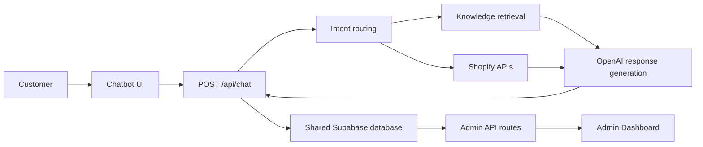
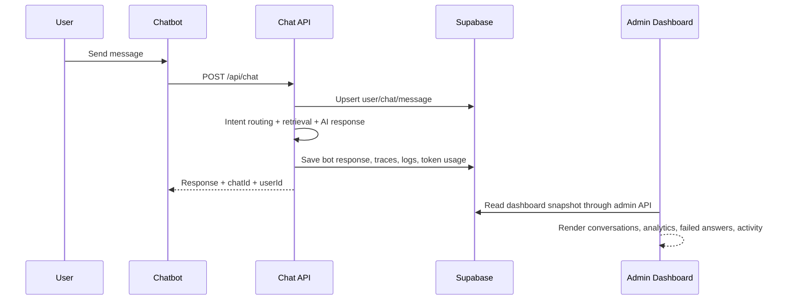
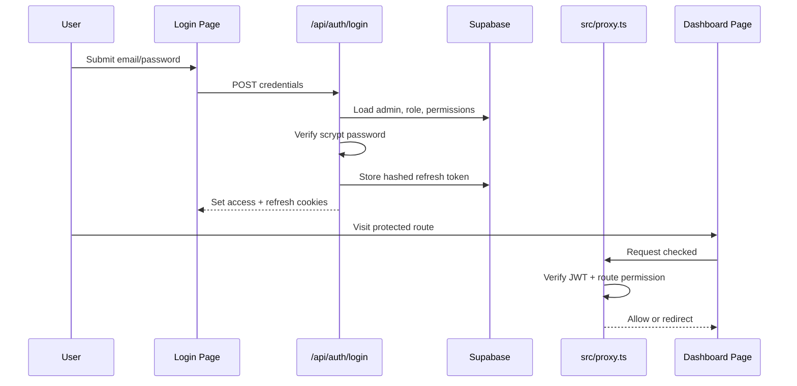

# Snakitos AI Support Agent

Snakitos AI Support Agent is a monorepo containing two connected applications:

- `apps/chatbot`: the customer-facing AI chatbot for the Snakitos store.
- `apps/admin`: the protected admin dashboard used to monitor, manage, and improve the chatbot.

Both applications are designed to use the same Supabase project. The chatbot handles customer conversations, retrieves product/order/knowledge context, generates safe responses, and stores activity. The admin dashboard reads the same database so administrators can review conversations, failed answers, analytics, token usage, knowledge sources, Shopify sync status, users, roles, and permissions.

## Project Overview

The system goal is to provide an ecommerce support chatbot with an operational control center.

The chatbot answers shopper questions about products, store policies, support, delivery, refunds, order tracking, product recommendations, and general Snakitos information. It uses structured intent routing, Shopify data, local knowledge files, optional Pinecone retrieval, OpenAI generation, and Supabase persistence.

The admin dashboard gives the team a secure interface for managing the AI support system. It includes JWT authentication, refresh tokens, profile management, profile image upload, module-level RBAC, light/dark theme support, monitoring, analytics, and management screens for knowledge, prompts, users, conversations, and support operations.



## Applications

| App | Path | Purpose | Default dev command |
| --- | --- | --- | --- |
| Chatbot | `apps/chatbot` | Customer-facing chat interface and `/api/chat` backend | `npm run dev:chatbot` |
| Admin Dashboard | `apps/admin` | Protected dashboard for operations, RBAC, monitoring, and management | `npm run dev:admin` |

## Implemented Features

### Chatbot

- Customer chat UI with session persistence in browser `localStorage`.
- `/api/chat` endpoint with input validation, rate limiting, and safe error fallback.
- Intent routing for general questions, product requests, support issues, and order tracking.
- Snakitos-specific structured intent classifier for ecommerce support flows.
- OpenAI chat completion integration using `gpt-4o`.
- Local knowledge files for policies, product metadata, FAQ knowledge, category knowledge, and RAG training data.
- Optional Pinecone retrieval through root/shared RAG utilities.
- Shopify Admin API integration for product search and verified order lookup.
- Conversation context using recent messages and in-memory session state.
- Supabase persistence for users, chats, messages, logs, mirrored admin chat sessions, answer traces, failed answers, token usage, and guardrail events.
- Safety guardrails for prompt injection, sensitive credential requests, OTP/password/card data, and unsupported input.
- WhatsApp/support fallback messaging with a direct customer chat link.

### Admin Dashboard

- JWT-based login and protected dashboard routes.
- Refresh token persistence through `admin_refresh_tokens`.
- Password hashing using Node `scrypt`.
- Logout and session invalidation.
- Role-based access control with module-level permissions.
- Users & Roles management with Create/Edit/Delete actions.
- Permission checklist on Create/Edit User forms.
- Sidebar visibility filtered by user permissions.
- Route-level protection through `src/proxy.ts`.
- Profile page for signed-in user details.
- Change password form with show/hide password toggles.
- Profile image upload using Supabase Storage.
- Light and Dark Mode theme system with persisted dashboard preference.
- Login page isolated to Light Mode.
- Dashboard performance cards and monitoring widgets.
- Conversations view with drawer details, clean bot answer formatting, display IDs, and copyable raw user IDs.
- Failed answers, analytics, token usage, tickets, audit logs, knowledge, uploads, crawler, Shopify sync, FAQs, chunks, prompts, playground, model settings, settings, and guardrails modules.
- Supabase-backed control-center snapshot endpoint for dashboard data.

## Technology Stack

| Area | Technology |
| --- | --- |
| Runtime | Node.js, npm workspaces |
| Framework | Next.js 16 App Router |
| Language | TypeScript |
| UI | React 19, Tailwind CSS, Lucide React, Recharts, Framer Motion |
| Forms and validation | React Hook Form, Zod |
| Database | Supabase Postgres |
| Storage | Supabase Storage |
| Auth | Custom JWT, signed cookies, refresh tokens, `scrypt` password hashing |
| AI | OpenAI API |
| Retrieval | Supabase tables and optional Pinecone |
| Ecommerce | Shopify Admin API |
| Deployment | Vercel recommended |

## Folder Structure

```text
.
|-- apps
|   |-- chatbot
|   |   |-- src/app                  # Chatbot Next.js app, page UI, /api/chat route
|   |   |-- src/server/config        # Chatbot runtime config loader
|   |   |-- src/server/data          # Local knowledge/RAG/product/policy data
|   |   |-- src/server/services      # AI, knowledge, Shopify, Supabase, support agent services
|   |   |-- src/server/types         # Chat/order TypeScript types
|   |   `-- src/server/utils         # Intent, validation, security, site-tree helpers
|   |-- admin
|   |   |-- src/app                  # Admin pages and API routes
|   |   |-- src/components           # Layout, common, control-center, provider, and UI components
|   |   |-- src/hooks                # Dashboard data hooks
|   |   |-- src/lib                  # Auth, DB, RBAC, env, services, formatting, response helpers
|   |   |-- src/types                # Admin dashboard shared types
|   |   |-- public                   # Logos and public dashboard assets
|   |   `-- supabase                # Admin database config, reset, seed, and migrations
|-- api                            # Legacy/root Vercel serverless endpoints
|-- scripts                        # RAG import, ingestion, sync, and test scripts
|-- supabase                       # Older/root Supabase schema and migrations
|-- services, lib, types, utils     # Legacy/root shared chatbot services
|-- README.md                      # Primary project documentation
`-- DEVELOPMENT.md                 # Contributor documentation
```

## Installation

### Prerequisites

- Node.js 20+ recommended.
- npm 11+ recommended because the root `packageManager` is `npm@11.12.1`.
- A Supabase project.
- Supabase CLI access through `npx supabase`.
- OpenAI API key.
- Shopify Admin API credentials if product/order features are required.
- Pinecone credentials only if you choose Pinecone retrieval.

Docker is only required for Supabase local development (`supabase start`, local DB reset, local seed). This project currently uses linked remote Supabase commands, so Docker is not required when using Supabase in the browser/cloud.

### Clone and Install

```powershell
git clone <repository-url>
cd Agent
npm install
```

### Configure Environment Variables

Create environment files from the examples:

```powershell
Copy-Item .env.example .env
Copy-Item apps/admin/.env.example apps/admin/.env
Copy-Item apps/chatbot/.env.example apps/chatbot/.env
```

Do not commit `.env` files.

Security note: if any example file contains real-looking API keys or tokens, rotate those credentials in the provider dashboard and replace the example values with placeholders before sharing the repository.

### Supabase Setup

Run these commands from `apps/admin`:

```powershell
cd apps/admin
npm run supabase:login
npm run supabase:link
npm run supabase:db:migrate
npm run supabase:db:seed
```

To reset the linked remote database using the project reset file, then rebuild and seed:

```powershell
cd apps/admin
npm run supabase:db:reset
npm run supabase:db:migrate
npm run supabase:db:seed
```

The current seed inserts admin roles and role-based admin users. For production, rotate seeded passwords or create production admins manually.

### Supabase Storage Setup

The admin profile avatar feature expects a bucket matching:

```text
UPLOAD_STORAGE_BUCKET=admin-uploads
```

Create the bucket in Supabase Storage if it does not already exist. Keep writes server-side through the admin API route.

### Start Development Servers

Run the chatbot:

```powershell
npm run dev:chatbot
```

Run the admin dashboard:

```powershell
npm run dev:admin
```

You can also run from inside each app:

```powershell
cd apps/chatbot
npm run dev
```

```powershell
cd apps/admin
npm run dev
```

### Build and Start

Build both apps:

```powershell
npm run build
```

Build only one app:

```powershell
npm run build:chatbot
npm run build:admin
```

Start production mode for an app:

```powershell
npm --prefix apps/chatbot run start
npm --prefix apps/admin run start
```

## Environment Variables

### Shared Variables

| Variable | Required | Used by | Purpose |
| --- | --- | --- | --- |
| `SUPABASE_URL` | Yes | Both | Supabase project URL for server-side clients. |
| `NEXT_PUBLIC_SUPABASE_URL` | Admin | Admin | Public Supabase URL for client-safe usage. |
| `SUPABASE_ANON_KEY` | Yes | Both | Supabase anon/publishable key. |
| `SUPABASE_SERVICE_ROLE_KEY` | Yes | Both | Server-only key for privileged database/storage access. Never expose to browser code. |
| `OPENAI_API_KEY` | Yes for AI | Both | OpenAI API key for chat and embeddings. |
| `OPENAI_EMBEDDING_MODEL` | Optional | Admin | Embedding model, defaults to `text-embedding-3-small`. |
| `RAG_VECTOR_PROVIDER` | Optional | Admin | `supabase` or `pinecone`; defaults to `supabase`. |
| `PINECONE_API_KEY` | Optional | Both | Required only for Pinecone vector retrieval/indexing. |
| `PINECONE_INDEX` | Optional | Both | Pinecone index name. |
| `PINECONE_NAMESPACE` | Optional | Both | Pinecone namespace. |
| `PINECONE_HOST` / `PINECONE_INDEX_HOST` | Optional | Chatbot | Optional Pinecone host override. |

### Admin Variables

| Variable | Required | Purpose |
| --- | --- | --- |
| `ADMIN_SESSION_SECRET` | Yes | Signs JWTs and tokens. Must be at least 32 characters. |
| `ADMIN_ACCESS_TOKEN_TTL_MINUTES` | Optional | Access token lifetime, default `15`. |
| `ADMIN_REFRESH_TOKEN_TTL_DAYS` | Optional | Refresh token lifetime, default `14`. |
| `ADMIN_BOOTSTRAP_EMAIL` | Optional | Creates a bootstrap admin on first server auth bootstrap. |
| `ADMIN_BOOTSTRAP_PASSWORD` | Optional | Password for bootstrap admin. Remove after first login. |
| `UPLOAD_STORAGE_BUCKET` | Optional | Supabase Storage bucket for uploads/avatars, default `admin-uploads`. |
| `NEXT_PUBLIC_ADMIN_BASE_PATH` | Optional | Public base path, commonly `/admin` for Vercel deployments. |
| `ADMIN_APP_URL` | Optional | Used by root/chatbot deployment to proxy `/admin` traffic to a dedicated admin deployment. |

### Chatbot and Shopify Variables

| Variable | Required | Purpose |
| --- | --- | --- |
| `OPENAI_MAX_TOKENS` | Optional | Chatbot generation token cap, default `1000`. |
| `SHOPIFY_SHOP_DOMAIN` | Optional | Public storefront domain. |
| `SHOPIFY_ADMIN_DOMAIN` | Required for Shopify Admin | Shopify admin domain such as `your-store.myshopify.com`. |
| `SHOPIFY_ADMIN_API_ACCESS_TOKEN` | Required for Admin API token flow | Shopify Admin API access token. |
| `SHOPIFY_CLIENT_ID` | Optional | Shopify client credential flow. |
| `SHOPIFY_CLIENT_SECRET` | Optional | Shopify client credential flow. |
| `SHOPIFY_API_VERSION` | Optional | Shopify API version, default `2025-01` in chatbot. |
| `SHOPIFY_STOREFRONT_BASE_URL` | Optional | Admin storefront link base, default `https://snakitos.com`. |
| `SUPPORT_WHATSAPP` | Optional | WhatsApp fallback number, currently `+92-343-6366369`. The chatbot UI opens this as `https://wa.me/923436366369` for the WhatsApp Support button. |
| `SUPPORT_PHONE` | Optional | Phone fallback number. |

## Database Architecture

The active admin migrations live in `apps/admin/supabase/migrations`.

Important migrations:

| Migration | Purpose |
| --- | --- |
| `202607140001_reset_and_rebuild_admin_backend.sql` | Rebuilds admin backend foundation tables. |
| `202607160001_unify_chatbot_admin_schema.sql` | Adds shared chatbot/admin tables and compatibility columns. |
| `202607170001_add_admin_profile_avatars.sql` | Adds admin avatar fields. |
| `202607180001_add_admin_module_rbac.sql` | Adds module-level RBAC tables and default assignments. |

### Core Admin Tables

| Table | Purpose |
| --- | --- |
| `admin_roles` | Role catalog: owner, admin, content manager, support agent, viewer. |
| `admins` | Admin users, password hashes, status, role, profile/avatar metadata. |
| `admin_refresh_tokens` | Hashed refresh tokens for admin sessions. |
| `audit_logs` / `admin_audit_logs` | Admin actions and operational audit trail. |
| `admin_module_permissions` | Permission catalog used by RBAC. |
| `admin_role_permission_defaults` | Default module permissions per role. |
| `admin_permission_assignments` | Per-admin permission assignments. |
| `settings` | Dashboard and model/settings records. |

### Knowledge and RAG Tables

| Table | Purpose |
| --- | --- |
| `knowledge_sources` | Website, file, FAQ, Shopify, and manual sources. |
| `knowledge_documents` | Knowledge documents derived from uploads/crawls/FAQ/product sync. |
| `uploaded_files` | Uploaded files and extraction status. |
| `knowledge_chunks` | Document chunks used for retrieval. |
| `rag_chunks` | Additional chunk storage for RAG metadata/embedding flows. |
| `ingestion_jobs` | File/crawler/sync ingestion job tracking. |
| `prompt_versions` | Prompt manager versions and rollback history. |
| `rag_test_cases` / `rag_test_runs` | Testing lab cases and results. |

### Chatbot and Monitoring Tables

| Table | Purpose |
| --- | --- |
| `users` | Chatbot users created from browser/session identifiers, email, or phone. |
| `chats` | Lightweight chatbot chat records. |
| `messages` | Raw chatbot messages by role. |
| `logs` | General chatbot activity logs. |
| `chat_sessions` | Admin-compatible conversation sessions. |
| `chat_messages` | Conversation rows displayed in the dashboard. |
| `answer_traces` | AI answer metadata, confidence, grounding, latency, and token details. |
| `token_usage_logs` | Token/cost records for analytics. |
| `failed_answers` | Missing-source or low-confidence answers requiring review. |
| `guardrail_events` | Safety/guardrail events. |
| `handoff_tickets` / `tickets` | Human support handoff and ticket tracking. |
| `alerts` | Operational alerts. |
| `system_health_checks` | Health status records. |

### Shared Data Flow



## API Documentation

### API Conventions

Most admin endpoints:

- Are under `/api/admin/*`.
- Require a valid admin JWT cookie.
- Use `withAdminAccess` or equivalent server helpers.
- Return JSON.
- Return errors as JSON with an error code/message where supported.

Auth endpoints:

- Are under `/api/auth/*`.
- Login creates access and refresh cookies.
- Logout clears cookies and revokes refresh state.
- Refresh rotates/validates the session.

Chatbot endpoints:

- `/api/chat` is public but validated and rate limited.
- Legacy root Vercel endpoints in `/api/*.ts` use `ADMIN_SESSION_SECRET` for protected operational access.

### Chatbot API

#### `POST /api/chat`

Purpose: process a customer chat message.

Used by: `apps/chatbot/src/app/page.tsx`.

Auth: public endpoint with validation and rate limiting.

Request body:

```json
{
  "message": "Do you have spicy snacks?",
  "userId": "optional-user-id",
  "chatId": "optional-chat-id",
  "email": "optional@example.com",
  "phone": "+923001234567"
}
```

Response:

```json
{
  "response": "Yes, here are some spicy options...",
  "intent": "product",
  "chatId": "uuid",
  "userId": "uuid",
  "data": []
}
```

Why it exists: this is the main chatbot backend. It validates the message, routes intent, retrieves context, calls AI/Shopify/knowledge services, persists data in Supabase, and returns a customer-safe answer.

### Auth API

| Method | Route | Purpose | Request body | Response | Auth |
| --- | --- | --- | --- | --- | --- |
| `POST` | `/api/auth/login` | Authenticate admin user and issue cookies | `{ "email": "...", "password": "..." }` | `{ "admin": {...} }` and auth cookies | Public |
| `POST` | `/api/auth/logout` | Revoke refresh token and clear cookies | None | `{ "success": true }` | Admin session |
| `POST` | `/api/auth/refresh` | Refresh access token using refresh cookie | None | refreshed session payload | Refresh cookie |

Example login:

```powershell
Invoke-RestMethod -Method Post `
  -Uri http://localhost:3000/api/auth/login `
  -ContentType "application/json" `
  -Body '{"email":"admin@example.com","password":"your-password"}'
```

### Admin API Inventory

The following endpoints are implemented in `apps/admin/src/app/api/admin`.

| Methods | Route | Purpose | Typical body/query | Response | Required auth |
| --- | --- | --- | --- | --- | --- |
| `GET,PATCH,POST` | `/api/admin/alerts` | List, create, or update operational alerts | alert fields or patch status | alert records | Admin JWT |
| `GET` | `/api/admin/alerts/latest` | Fetch latest alert summary | none | latest alert payload | Admin JWT |
| `GET` | `/api/admin/analytics` | Fetch analytics metrics | optional query filters | analytics payload | Admin JWT |
| `GET` | `/api/admin/answer-traces` | List AI answer traces | query filters | traces | Admin JWT |
| `GET,POST` | `/api/admin/audit-logs` | Read or create audit log entries | log metadata | audit logs | Admin JWT |
| `GET,PATCH` | `/api/admin/chats` | List/update chat sessions | session status fields | sessions | Admin JWT |
| `POST` | `/api/admin/chats/[id]/notes` | Add a note to a chat | `{ "note": "..." }` | updated note result | Admin JWT |
| `DELETE,PATCH` | `/api/admin/chunks/[id]` | Update or delete knowledge chunk | chunk fields | updated/deleted result | Admin JWT |
| `GET` | `/api/admin/control-center` | Fetch full dashboard snapshot | none | complete dashboard state | Admin JWT |
| `POST` | `/api/admin/crawler/clear` | Clear crawler data/logs | optional scope | success payload | Admin JWT |
| `GET,POST` | `/api/admin/crawler/start` | Inspect/start website crawl | crawl config | crawl job | Admin JWT |
| `POST` | `/api/admin/crawler/stop` | Stop active crawler | none | success payload | Admin JWT |
| `DELETE,POST` | `/api/admin/crawler/[id]` | Retry/delete crawler item | item id in route | result | Admin JWT |
| `GET` | `/api/admin/dashboard` | Fetch dashboard metrics | none | metric cards | Admin JWT |
| `GET` | `/api/admin/failed-answers` | List failed answers | filters | failed answer rows | Admin JWT |
| `PATCH` | `/api/admin/failed-answers/[id]` | Update failed answer status/fix | status/fix fields | updated row | Admin JWT |
| `GET,POST` | `/api/admin/faqs` | List/create FAQ entries | question/answer fields | FAQ rows | Admin JWT |
| `DELETE,PATCH` | `/api/admin/faqs/[id]` | Update/delete FAQ | FAQ fields | result | Admin JWT |
| `GET,PATCH,POST` | `/api/admin/handoffs` | List/create/update handoff records | ticket fields | handoff rows | Admin JWT |
| `GET` | `/api/admin/ingestion-jobs` | List ingestion jobs | filters | jobs | Admin JWT |
| `GET,PATCH` | `/api/admin/ingestion-jobs/[id]` | Read/update ingestion job | job fields | job | Admin JWT |
| `GET` | `/api/admin/interactions` | Fetch interaction logs | none | interactions | Admin JWT |
| `DELETE,GET,PATCH,POST` | `/api/admin/knowledge` | Manage knowledge documents | document fields | knowledge rows | Admin JWT |
| `GET,POST` | `/api/admin/model-settings` | Read/update model settings | model config | settings | Admin JWT |
| `POST` | `/api/admin/playground/test` | Test chatbot response from dashboard | prompt/message fields | test response | Admin JWT |
| `POST` | `/api/admin/profile/avatar` | Upload signed-in admin avatar | multipart image | avatar URL/path | Admin JWT |
| `POST` | `/api/admin/profile/password` | Change signed-in admin password | current/new password | success | Admin JWT |
| `GET,POST` | `/api/admin/prompt-manager` | Read/create prompt manager records | prompt fields | prompt data | Admin JWT |
| `GET,POST` | `/api/admin/prompts` | List/create prompt versions | prompt fields | prompt versions | Admin JWT |
| `DELETE,GET,PATCH` | `/api/admin/prompts/[id]` | Read/update/delete prompt version | prompt patch | result | Admin JWT |
| `POST` | `/api/admin/reindex` | Trigger reindexing | source/filter fields | job result | Admin JWT |
| `GET,POST` | `/api/admin/settings` | Read/update settings | settings object | settings | Admin JWT |
| `GET,POST` | `/api/admin/shopify/connect` | Check/connect Shopify credentials | none | connection status | Admin JWT |
| `PATCH` | `/api/admin/shopify/products/[id]` | Update Shopify product metadata/status | product fields | product | Admin JWT |
| `POST` | `/api/admin/shopify/sync` | Trigger Shopify sync | sync options | sync job | Admin JWT |
| `GET,POST` | `/api/admin/sources` | List/create knowledge sources | source fields | sources | Admin JWT |
| `DELETE,GET,PATCH` | `/api/admin/sources/[id]` | Read/update/delete source | source fields | result | Admin JWT |
| `GET` | `/api/admin/system-health` | Fetch system health checks | none | health status | Admin JWT |
| `GET,POST` | `/api/admin/tests` | List/create RAG tests | test case fields | tests | Admin JWT |
| `GET,PATCH,POST` | `/api/admin/tickets` | List/create/update support tickets | ticket fields | tickets | Admin JWT |
| `GET` | `/api/admin/token-usage` | Fetch token/cost analytics | filters | usage rows | Admin JWT |
| `DELETE,GET,POST` | `/api/admin/upload` | List/upload/delete files | multipart file or id | upload/job result | Admin JWT |
| `GET,POST` | `/api/admin/users` | List/create admins | name/email/password/role/status/permissions | users | Admin JWT + `users.manage` |
| `DELETE,PATCH` | `/api/admin/users/[id]` | Update/delete admin user | user patch fields | result | Admin JWT + `users.manage` |

Representative admin request:

```powershell
Invoke-RestMethod -Method Get `
  -Uri http://localhost:3000/api/admin/control-center `
  -WebSession $session
```

Representative error:

```json
{
  "error": {
    "code": "UNAUTHORIZED",
    "message": "Authentication is required."
  }
}
```

### Legacy Root Vercel API

These endpoints exist under the root `api` directory for older/serverless deployments.

| Method | Route | Purpose | Request | Response | Auth |
| --- | --- | --- | --- | --- | --- |
| `GET` | `/api` | Health/config readiness | none | service health | Public |
| `POST` | `/api/chat` | Legacy chatbot handler | chat body | chat response | Public |
| `GET` | `/api/products?q=...` | Shopify product lookup | query string | `{ "products": [...] }` | Admin secret |
| `POST` | `/api/orders` | Verified order lookup | `{ "orderId": "...", "phone": "..." }` | `{ "verified": true, "order": {...} }` | Admin secret |
| `GET,POST` | `/api/logs` | Read/write chatbot logs | query/body | logs or success | Admin secret |

## Authentication Flow



Key details:

- Passwords are stored as `scrypt:<salt>:<hash>`.
- Access tokens are signed JWTs.
- Refresh tokens are random server-generated tokens stored hashed in Supabase.
- Unauthenticated users are redirected to `/login`.
- Authenticated users without a required module permission are redirected to a safe allowed page.

## Chatbot Flow

1. The browser stores `chat_id`, `chat_user_id`, and optional phone in `localStorage`.
2. The user sends a message from `apps/chatbot/src/app/page.tsx`.
3. The frontend calls `POST /api/chat`.
4. The API validates message length/content and applies rate limiting.
5. `supportAgentService.handleChat` resolves or creates a chat session.
6. The user message is saved in Supabase.
7. The system detects intent and routes to product, order, support, policy, or general flows.
8. The service uses Shopify, local knowledge, optional Pinecone retrieval, and OpenAI where needed.
9. The bot response is sanitized and returned to the browser.
10. In the background, Supabase stores messages, logs, answer traces, token usage, failed answers, and guardrail events.
11. The admin dashboard reads those records through admin APIs.

## Admin Dashboard Flow

1. Admin logs in through `/login`.
2. The browser receives secure auth cookies and stores basic current user state for UI.
3. Protected pages call `/api/admin/control-center` or domain-specific APIs.
4. API routes validate the admin session and permissions.
5. Supabase service-role client reads/writes operational data.
6. The UI renders cards, charts, tables, drawers, forms, and modals.
7. Mutations write audit logs where supported.

## Permissions System

RBAC is centralized in `apps/admin/src/lib/rbac.ts`.

Roles:

- `owner`: full access.
- `admin`: broad admin access except selected owner-only features.
- `content_manager`: knowledge, prompts, AI controls, analytics, and profile.
- `support_agent`: conversations, failed answers, tickets, chat playground, FAQs, and profile.
- `viewer`: read-focused dashboard, knowledge, conversations, analytics, token usage, and profile.

Permission tables:

- `admin_module_permissions`: available modules.
- `admin_role_permission_defaults`: default permissions per role.
- `admin_permission_assignments`: actual user permissions.

How enforcement works:

- Create/Edit User forms load available permissions and defaults.
- Selected permissions are stored in `admin_permission_assignments`.
- Login embeds permissions into the JWT payload.
- `src/proxy.ts` maps routes to permissions and blocks unauthorized direct URL access.
- Sidebar navigation hides unauthorized modules.
- Sensitive dashboard datasets are filtered by permissions in the control-center API.

## Theme System

- Admin dashboard supports Light and Dark Mode.
- Dashboard theme preference is persisted for authenticated/admin pages.
- Login page is intentionally isolated and always renders in Light Mode.
- Brand colors are defined through global styles/design tokens.
- Components should use theme-aware classes and variables rather than hardcoded one-off colors.

## Deployment

### Recommended Vercel Setup

Deploy the chatbot and admin dashboard as two Vercel projects from the same Git repository:

| Vercel project | Root directory | Purpose |
| --- | --- | --- |
| `snakitos-chatbot` | `apps/chatbot` | Public chatbot deployment |
| `snakitos-admin` | `apps/admin` | Protected admin dashboard |

This keeps build settings, environment variables, domains, and logs cleanly separated.

### Chatbot Deployment

1. Create a Vercel project with root directory `apps/chatbot`.
2. Add chatbot env vars: Supabase, OpenAI, Shopify, optional Pinecone, support contact values. If `SUPPORT_WHATSAPP` is set in Vercel, keep it synced with the official support number: `+92-343-6366369`.
3. Build command: `npm run build`.
4. Output is handled by Next.js.

### Admin Deployment

1. Create a Vercel project with root directory `apps/admin`.
2. Add admin env vars: Supabase, `ADMIN_SESSION_SECRET`, OpenAI, Shopify, storage bucket, vector provider.
3. Set `NEXT_PUBLIC_ADMIN_BASE_PATH=/admin` if deploying with `/admin` base path.
4. Run Supabase migrations before first login.
5. Build command: `npm run build`.

### Same Repository Deployment

Yes, both apps can be deployed from the same repository. Create two Vercel projects and point each project to its own root directory. Do not expect one Vercel project to automatically deploy both apps unless you build a custom routing/proxy strategy.

### Supabase Deployment

Supabase is already hosted by Supabase. For production:

- Run migrations from `apps/admin`.
- Create required storage buckets.
- Store service keys only in server-side environment variables.
- Keep RLS enabled and use service-role access only from trusted server routes.

## Troubleshooting

| Issue | Cause | Fix |
| --- | --- | --- |
| `Docker Desktop is a prerequisite` | Running local Supabase commands without Docker | Use linked remote commands or install Docker for local Supabase. |
| `supabase seed` shows usage only | CLI command changed; no default seed subcommand used | Use `npm run supabase:db:seed`, which runs `supabase db query --linked --file supabase/seed.sql`. |
| Admin login fails | Missing seed, wrong password, invalid env, or old tokens | Run migrations/seeds, verify `ADMIN_SESSION_SECRET`, log out/in. |
| Protected route still visible | Browser has old JWT or route permission missing | Log out/in and verify `src/lib/rbac.ts` route mapping. |
| Build fails fetching Geist fonts | Build environment cannot access Google Fonts | Allow network during build or switch to local fonts. |
| Chat messages not appearing in dashboard | Supabase env missing, migration missing, or background persistence failed | Check `SUPABASE_SERVICE_ROLE_KEY`, migrations, `logs`, `messages`, `chat_sessions`, and API logs. |
| Profile image does not persist | Storage bucket missing or upload route env incorrect | Create bucket named by `UPLOAD_STORAGE_BUCKET` and verify service role key. |
| Shopify features fail | Missing Admin API credentials | Set `SHOPIFY_ADMIN_DOMAIN` and `SHOPIFY_ADMIN_API_ACCESS_TOKEN` or OAuth credentials. |
| Pinecone retrieval unavailable | Pinecone env missing | Either set Pinecone env vars or use `RAG_VECTOR_PROVIDER=supabase`. |

## Future Improvements

- Replace any real-looking values in `.env.example` files with placeholders and rotate exposed secrets.
- Add automated integration tests for auth, RBAC, chat persistence, and dashboard data loading.
- Add end-to-end tests for direct URL route protection.
- Add automated migration validation in CI.
- Add local Supabase Docker workflow for contributors who prefer isolated local development.
- Add richer dashboard API documentation generated from route schemas.
- Add production monitoring, structured logging, and alerting.
- Add a formal prompt review workflow and approval states.
- Add granular read/write permissions beyond module-level access.
- Add customer identity linking if the chatbot is embedded into authenticated storefront sessions.
